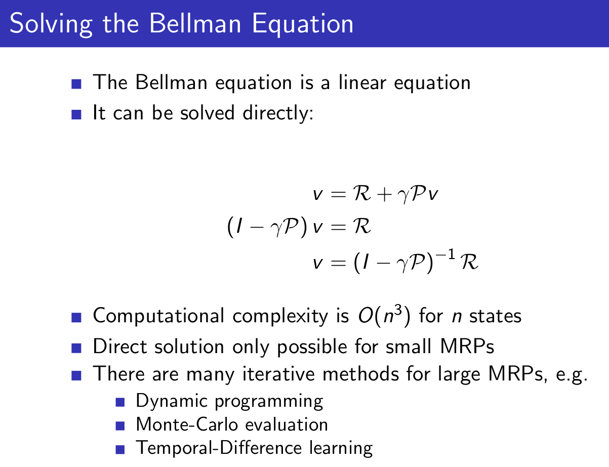

This classic 10 part course, taught by Reinforcement Learning (RL) pioneer David Silver, was recorded in 2015 and remains a popular resource for anyone wanting to understand the fundamentals of RL.

[Website with 10 lectures: videos and slides](https://deepmind.com/learning-resources/-introduction-reinforcement-learning-david-silver)

[My repo with slides](https://github.com/castorfou/introduction-reinforcement-learning-david-silver)

## 3/9/21 - Lecture 1: Introduction to Reinforcement Learning

This introduction is essentially about giving examples of RL to have a good intuition about this field and to provide definitions or context:

- Definitions: rewards, actions, agent, environment, state (and history)
- Major components: policy, value function, model
- Categorizing RL agents (taxonomy): value based, policy based, actor critic, model free, model based
- Learning and planning
- Prediction and control

And David gives 2 references:

- [well known](/guillaume_blog/blog/reinforcement-learning-readings.html) Introduction to Reinforcement Learning, Sutton and Barto, 1998
- Algorithms for Reinforcement Learning, Szepesvari. Available [online](http://www.ualberta.ca/~szepesva/papers/RLAlgsInMDPs.pdf).

Policy $$\pi$$(s): essentially a map from state to action. Can be deterministic $$\pi$$(s) or stochastic $$\pi$$(a&#124;s).

Value function v$\pi$(s): is a prediction of expected future reward.

Model: it is not the environment itself but useful to predict what the environment will do next. 2 types of models: transitions model and rewards model. Transition model predicts the next state (e.g. based on dynamics). Reward model predicts the next immediate reward.

A lot of algorithms are model-free and doesn't require these models. It is a fundamental distinctions in RL.

And then David explains 2 fundamental different problems with Learning vs Planning.

With Learning, environment is unknown, agent interacts directly with the environment and improves its policy.

With Planning, a model of environment is known, and agent "plays" with this model and improves its policy.

These 2 problems may be linked where you start to learn from the environment and apply planning then.

2 examples based on atari games. 

Another topic is exploration vs exploitation then prediction and control.

## 3/10/21 - Lecture 2: Markov Decision Processes

***Markov decision processes*** formally describe an environment for reinforcement learning.

***Markov property***: the future is independent of the past given the present.

***Markov Process*** (or ***Markov Chain***) is the tuple (S, P)

We can take sample episodes from this chain. (e.g. C1 FB FB C1 C2 C3 Pub C1 FB FB FB C1 C2 C3 Pub C2 Sleep)

We can formalize the transition matrix from s to s'.

When you add reward you get ***Markov reward process*** (S, P, R, $$\gamma$$)

Reward here is a function to map for each state the immediate reward.

$$\gamma$$ is the discounted factor, $$\epsilon$$ [0,1]. David explains why we could need such discount.

***Return*** Gt is the total discounted reward at time-step t for a given sample.

***Value function*** v(s) is really what we care about, it is the long-term value of state s.

***Bellman Equation for MRPs***

The value function can be decomposed into two parts:
- immediate reward Rt+1
- discounted value of next state $$\gamma$$.v (St+1)

We use that to calculate value function with $$\gamma$$ $\neq$ 0.

And calculating value function can be seen as the resolution of this linear equation:

And now we introduce actions and it gives ***Markov Decision Process***

And we introduce policy

Then we can define the *state-value function* v$\pi$(s,a) for a given policy $$\pi$$

and *action-value function* q$\pi$(s,a) for a given policy $$\pi$$

And impact on Bellman Equation ends like that:

v is giving us how good it is to be in a state. q is giving us how good is it to take an action.

And then we have the Bellman equation expressed with v and q.

We don't care much about a given v$\pi$, we want to get the best policy. And ultimately to get q* which is the **optimal action value function**.

The optimal value function specifies the best possible performance in the MDP.
A MDP is “solved” when we know the optimal value function q*.

What we really care about is **optimal policy** $$\pi$$*. There is a partial ordering about policies. And a theorem saying that for any MDP, there exists at least one optimal policy.

So the optimal value function calculation is similar to what we did earlier when we averaged the value of the next state but now we take the max instead of average.

So no we can write the **Bellman Optimality Equation**. Unfortunately this is non-linear.

There are many approaches such as iterative ones. 

- Value Iteration
- Policy Iteration
- Q-learning
- Sarsa

