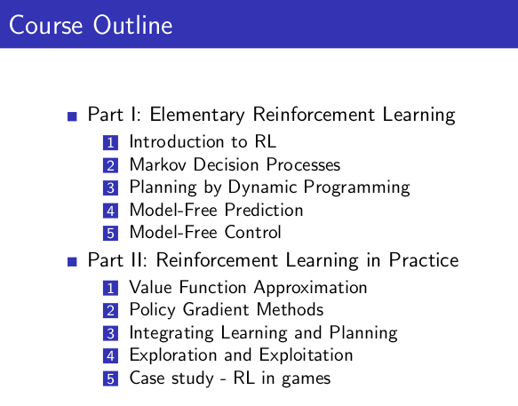
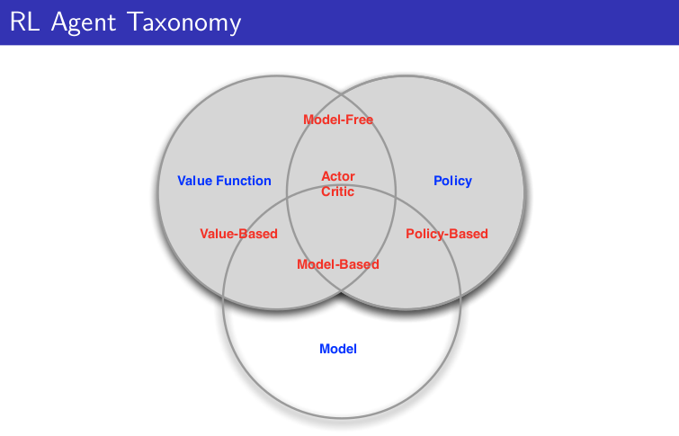

This classic 10 part course, taught by Reinforcement Learning (RL) pioneer David Silver, was recorded in 2015 and remains a popular resource for anyone wanting to understand the fundamentals of RL.

[Website with 10 lectures: videos and slides](https://deepmind.com/learning-resources/-introduction-reinforcement-learning-david-silver)

[My repo with slides](https://github.com/castorfou/introduction-reinforcement-learning-david-silver)

## 3/9/21 - Lecture 1: Introduction to Reinforcement Learning

This introduction is essentially about giving examples of RL to have a good intuition about this field and to provide definitions or context:

- Definitions: rewards, actions, agent, environment, state (and history)
- Major components: policy, value function, model
- Categorizing RL agents (taxonomy): value based, policy based, actor critic, model free, model based
- Learning and planning
- Prediction and control

And David gives 2 references:

- [well known](/guillaume_blog/blog/reinforcement-learning-readings.html) Introduction to Reinforcement Learning, Sutton and Barto, 1998
- Algorithms for Reinforcement Learning, Szepesvari. Available [online](http://www.ualberta.ca/~szepesva/papers/RLAlgsInMDPs.pdf).

Policy $$\pi$$(s): essentially a map from state to action. Can be deterministic $$\pi$$(s) or stochastic $$\pi$$(a|s).

Value function v$\pi$(s): is a prediction of expected future reward.

Model: it is not the environment itself but useful to predict what the environment will do next. 2 types of models: transitions model and rewards model. Transition model predicts the next state (e.g. based on dynamics). Reward model predicts the next immediate reward.

A lot of algorithms are model-free and doesn't require these models. It is a fundamental distinctions in RL.

And then David explains 2 fundamental different problems with Learning vs Planning.

With Learning, environment is unknown, agent interacts directly with the environment and improves its policy.

With Planning, a model of environment is known, and agent "plays" with this model and improves its policy.

These 2 problems may be linked where you start to learn from the environment and apply planning then.

2 examples based on atari games. 

Another topic is exploration vs exploitation then prediction and control.