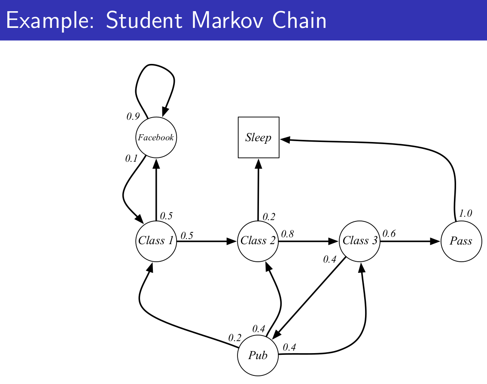
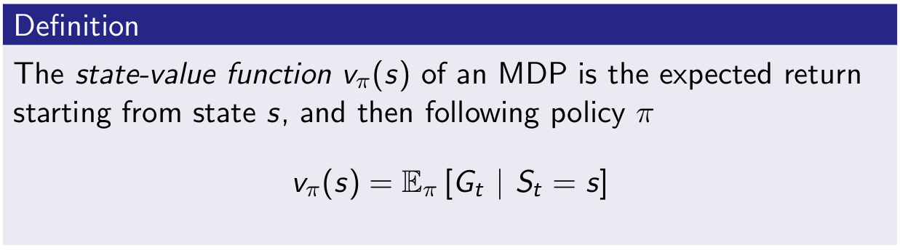
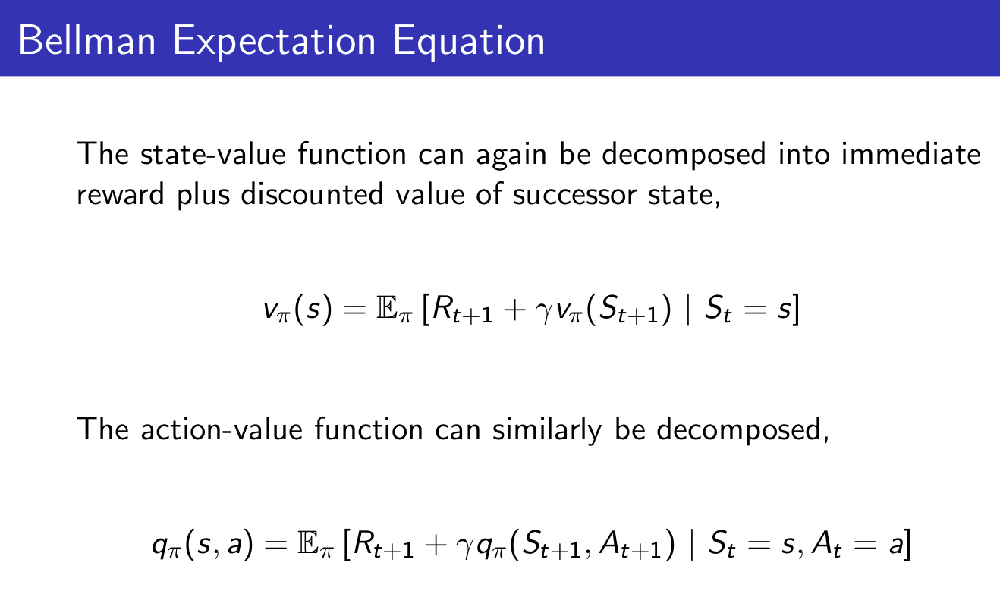

This classic 10 part course, taught by Reinforcement Learning (RL) pioneer David Silver, was recorded in 2015 and remains a popular resource for anyone wanting to understand the fundamentals of RL.

[Website with 10 lectures: videos and slides](https://deepmind.com/learning-resources/-introduction-reinforcement-learning-david-silver)

[My repo with slides](https://github.com/castorfou/introduction-reinforcement-learning-david-silver)

## 3/9/21 - Lecture 1: Introduction to Reinforcement Learning

This introduction is essentially about giving examples of RL to have a good intuition about this field and to provide definitions or context:

- Definitions: rewards, actions, agent, environment, state (and history)
- Major components: policy, value function, model
- Categorizing RL agents (taxonomy): value based, policy based, actor critic, model free, model based
- Learning and planning
- Prediction and control

And David gives 2 references:

- [well known](/guillaume_blog/blog/reinforcement-learning-readings.html) Introduction to Reinforcement Learning, Sutton and Barto, 1998
- Algorithms for Reinforcement Learning, Szepesvari. Available [online](http://www.ualberta.ca/~szepesva/papers/RLAlgsInMDPs.pdf).

Policy $$\pi$$(s): essentially a map from state to action. Can be deterministic $$\pi$$(s) or stochastic $$\pi$$(a&#124;s).

Value function v$\pi$(s): is a prediction of expected future reward.

Model: it is not the environment itself but useful to predict what the environment will do next. 2 types of models: transitions model and rewards model. Transition model predicts the next state (e.g. based on dynamics). Reward model predicts the next immediate reward.

A lot of algorithms are model-free and doesn't require these models. It is a fundamental distinctions in RL.

And then David explains 2 fundamental different problems with Learning vs Planning.

With Learning, environment is unknown, agent interacts directly with the environment and improves its policy.

With Planning, a model of environment is known, and agent "plays" with this model and improves its policy.

These 2 problems may be linked where you start to learn from the environment and apply planning then.

2 examples based on atari games. 

Another topic is exploration vs exploitation then prediction and control.

## 3/10/21 - Lecture 2: Markov Decision Processes

***Markov decision processes*** formally describe an environment for reinforcement learning.

***Markov property***: the future is independent of the past given the present.

***Markov Process*** (or ***Markov Chain***) is the tuple (S, P)

We can take sample episodes from this chain. (e.g. C1 FB FB C1 C2 C3 Pub C1 FB FB FB C1 C2 C3 Pub C2 Sleep)

We can formalize the transition matrix from s to s'.

When you add reward you get ***Markov reward process*** (S, P, R, $$\gamma$$)

Reward here is a function to map for each state the immediate reward.

$$\gamma$$ is the discounted factor, $$\epsilon$$ [0,1]. David explains why we could need such discount.

***Return*** Gt is the total discounted reward at time-step t for a given sample.

***Value function*** v(s) is really what we care about, it is the long-term value of state s.

***Bellman Equation for MRPs***

The value function can be decomposed into two parts:
- immediate reward Rt+1
- discounted value of next state $$\gamma$$.v (St+1)

We use that to calculate value function with $$\gamma$$ $\neq$ 0.

And calculating value function can be seen as the resolution of this linear equation:

And now we introduce actions and it gives ***Markov Decision Process***

And we introduce policy

Then we can define the *state-value function* v$\pi$(s,a) for a given policy $$\pi$$

and *action-value function* q$\pi$(s,a) for a given policy $$\pi$$

And impact on Bellman Equation ends like that:

v is giving us how good it is to be in a state. q is giving us how good is it to take an action.

And then we have the Bellman equation expressed with v and q.

We don't care much about a given v$\pi$, we want to get the best policy. And ultimately to get q* which is the **optimal action value function**.

The optimal value function specifies the best possible performance in the MDP.
A MDP is “solved” when we know the optimal value function q*.

What we really care about is **optimal policy** $$\pi$$*. There is a partial ordering about policies. And a theorem saying that for any MDP, there exists at least one optimal policy.

So the optimal value function calculation is similar to what we did earlier when we averaged the value of the next state but now we take the max instead of average.

So no we can write the **Bellman Optimality Equation**. Unfortunately this is non-linear.

There are many approaches such as iterative ones. 

- Value Iteration
- Policy Iteration
- Q-learning
- Sarsa

## 3/12/21 - Lecture 3: Planning by Dynamic Programming

Will discuss from the agent side: how to solve these MDP problems.

David starts with general ideas on dynamic programming. (programming in a sense of policy)

Value function is an important idea for RL because it sotres valuable information that you can later reuse (it embeds solutions). And Bellman equation gives the recursive decomposition.

**Planning by Dynamic Programming**

We assume full knowledge of the MDP. Dynamic programming is used for planning in an MDP. With 2 usages:

* prediction: given MDP and policy $$\pi$$, we predict the value of this policy v$\pi$.
* control: given MDP, we get optimal value function v&ast; and optimal policy $\pi$&ast;.

And by full MDP it would mean for an atari game to have access to internal code to calculate everything.

We need the 2 aspects to solve MDP: prediction to value policy, and control to get the best one.

**Policy Evaluation**

Problem: evaluate a given policy π
Solution: iterative application of Bellman expectation backup

(Bellman expectation is used in prediction, Bellman optimality is used in control)

David takes an example with a small grid-world and calculates iteratively (k=0, 1, 2, ...) v(s) for a uniform random policy (north, south, east, west with prob 0.25) (left column). And then we follow policy greedily using v function. (right column)

**Policy Iteration**

In small grid-world example, just by evaluating the policy and act greedily were sufficient to get the optimal policy. This is not generally the case. In general, need more iterations of  evaluation (iterative policy evaluation) / improvement (greedy policy).
But this process of policy iteration always converges to π∗

David uses Jack's Car Rental where it needs 4 steps to get the optimal policy.  And explains why acting greedy improves the policy.       And if improvement stops, Bellman optimality equation is satisfied, we have our optimal policy.

Some question then about convergence of v$\pi$ . Why not update policy at each step of evaluation -> this is value iteration.

**Value Iteration**

Problem: find optimal policy π
Solution: iterative application of Bellman optimality backup

**Extensions to dynamic programming**

DP uses full-width backups. It is effective for medium-sized problems. Curse of dimensionality for large problems. Even one backup can be too expensive.

One solution is to **sample backups**.

Advantages:
Model-free: no advance knowledge of MDP required
Breaks the curse of dimensionality through sampling
Cost of backup is constant, independent of n = |S|

## 3/15/21 - Lecture 4: Model-Free Prediction

Model-Free: no-one gives us the MDP. And we still want to solve it.

* **Monte-Carlo learning**: basically methods which goes all the way to the end of trajectory and estimates value by looking at sample returns.

* **Temporal-Difference learning**: goes one step ahead and estimates after one step
* **TD($$\lambda$$)**: unify both approaches

We give up the assumption giving how the environment works (which is highly unrealistic for interesting problems). We break it down in 2 pieces (as with previous lecture with planning):

* policy evaluation case (this lecture) - how much reward we get from that policy (in model-free envt)
* control (next lecture) - find the optimum value function and then optimum policy

**Monte-Carlo Reinforcement Learning**

We go all the way through the episodes and we take sample returns. So the estimated value function can be the average of all returns. You have to terminate to perform this mean.

It means we use the *empirical mean return* in place of *expected return*. (by *law of large numbers*, this average returns will converge to value function as the number of episodes for that state tends to infinity)

**Temporal-Difference Reinforcement Learning**

TD learns from incomplete episodes, by bootstrapping

David takes an example from Sutton about predicting time to commute home, comparing MC and TD.

TD target (Rt+1+$$\gamma$$Vt+1) is biased estimate of v$\pi$(St), but has lower variance than the return Gt.

David compares perf of MC, TD(0), ... using Random Walk example and different values of $$\alpha$$.

## 3/18/21 - Lecture 5: Model-Free Control

Distinction between on-policy (learning by doing the job) and off-policy (following someone else behavior)

**on-policy**

In Monte-Carlo approach, we have 2 issues. First is that we don't have access to model so we should use Q(s, a) instead of v(s). Second is lack of exploration so we should use $$\epsilon$$-greedy policy.

With GLIE (Greedy in the Limit with Infinite Exploration), we can update Q after each episodes. 

We will now use TD:

Natural idea: use TD instead of MC in our control loop

* Apply TD to Q(S, A)
* Use $$\epsilon$$-greedy policy improvement
* Update every time-step

This is SARSA update. Every single time-step we update our diagram.

A generalisation is n-step Sarsa. n=1 is standard Sarsa. n=$$\infty$$ is MC.

To get the best of both worlds, we consider Sarsa($$\lambda$$). We have a forward version

And a backward version which allows online experience. Thanks to eligibility traces.

**off-policy**

Why is this important?

- Learn from observing humans or other agents
- Re-use experience generated from old policies π 1 , π 2 , ..., π t−1
- Learn about optimal policy while following exploratory policy
- Learn about multiple policies while following one policy

We can apply it in importance sampling for off-policy. With Monte-Carlo it is however useless due to high variance. It is imperative to to TD.

We can apply that to Q-learning. We can use greedy slection on target policy $$\pi$$ and $$\epsilon$$ greedy on behaviour policy $$\mu$$.

## 4/27/21 - Lecture 6: Value Function Approximation

How to scale up value function approach.

**Value Function Approximation**

So far we have represented value function by a lookup table
Every state s has an entry V (s)
Or every state-action pair s, a has an entry Q(s, a)

Solution for large MDPs:
Estimate value function with function approximation
v̂ (s, w) ≈ v π (s)
or q̂(s, a, w) ≈ q π (s, a)
Generalise from seen states to unseen states
Update parameter w using MC or TD learning

There are many function approximators, e.g.

- **Linear combinations of features**
- **Neural network**
- Decision tree
- Nearest neighbour
- Fourier / wavelet bases

We focus on **differentiable** function approximators.

