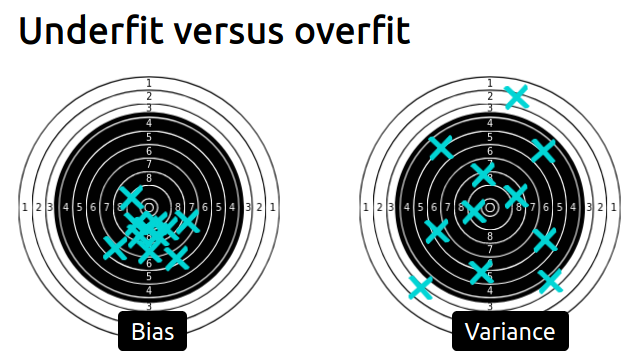

This is a [MOOC](https://lms.fun-mooc.fr/courses/course-v1:inria+41026+session01/info) by Inria team, in charge of scikit-learn.


> After a fair amount of pedagogical and technical preparation work, we offer you today a practical course with:
>
> - 7 modules + 1 introductory module
> - 9 video lessons to explain the main machine learning concepts
> - 71 programming notebooks (you don't have to install anything) to get hands-on skills
> - 27 quizzes, 7 wrap-up quizzes and 23 exercises to train and deepen your practice


[Syllabus](https://lms.fun-mooc.fr/courses/course-v1:inria+41026+session01/496272d6f8444957a7014122a4646116/)

Introduction:  Machine Learning concepts, then

Module 1. The Predictive Modeling Pipeline 

Module 2. Selecting the best model 

Module 3. Hyperparameter tuning 

Module 4. Linear Models 

Module 5. Decision tree models 

Module 6. Ensemble of models

Module 7. Evaluating model performance


[INRIA github](https://github.com/INRIA/scikit-learn-mooc) contains everything of this mooc: slides, datasets, notebooks (not videos)

I have forked it, and I use local envt for assignments. 

```bash
~/git/guillaume$ git clone git@github.com:castorfou/scikit-learn-mooc.git
~/git/guillaume$ cd scikit-learn-mooc/
~/git/guillaume/scikit-learn-mooc$ conda env create -f environment.yml
conda activate scikit-learn-course
```


## Introduction - Machine Learning concepts

[slides](https://inria.github.io/scikit-learn-mooc/slides/?file=ml_concepts.md#1)

## Module 1. The Predictive Modeling Pipeline 


###### Tabular data exploration

exploration of data: [01_tabular_data_exploration.ipynb](https://github.com/castorfou/scikit-learn-mooc/blob/master/notebooks/01_tabular_data_exploration.ipynb)

exercise M1.01: [01_tabular_data_exploration_ex_01.ipynb](https://github.com/castorfou/scikit-learn-mooc/blob/master/notebooks/01_tabular_data_exploration_ex_01.ipynb)


###### Fitting a scikit-learn model on numerical data

first model with scikit-learn: [02_numerical_pipeline_introduction.ipynb](https://github.com/castorfou/scikit-learn-mooc/blob/master/notebooks/02_numerical_pipeline_introduction.ipynb)

exercise M1.02: [02_numerical_pipeline_ex_00.ipynb](https://github.com/castorfou/scikit-learn-mooc/blob/master/notebooks/02_numerical_pipeline_ex_00.ipynb)

working with numerical data: [02_numerical_pipeline_hands_on.ipynb](https://github.com/castorfou/scikit-learn-mooc/blob/master/notebooks/02_numerical_pipeline_hands_on.ipynb)

exercise M1.03: [02_numerical_pipeline_ex_01.ipynb](https://github.com/castorfou/scikit-learn-mooc/blob/master/notebooks/02_numerical_pipeline_ex_01.ipynb)

preprocessing for numerical features: [02_numerical_pipeline_scaling.ipynb](https://github.com/castorfou/scikit-learn-mooc/blob/master/notebooks/02_numerical_pipeline_scaling.ipynb)


###### Handling categorical data

Encoding of categorical variables: [03_categorical_pipeline.ipynb](https://github.com/castorfou/scikit-learn-mooc/blob/master/notebooks/03_categorical_pipeline.ipynb)

> Thus, in general `OneHotEncoder` is the encoding strategy used when the downstream models are **linear models** while `OrdinalEncoder` is used with **tree-based models**.

Exercise M1.04: [03_categorical_pipeline_ex_01.ipynb](https://github.com/castorfou/scikit-learn-mooc/blob/master/notebooks/03_categorical_pipeline_ex_01.ipynb)

Using numerical and categorical variables together: [03_categorical_pipeline_column_transformer.ipynb](https://github.com/castorfou/scikit-learn-mooc/blob/master/notebooks/03_categorical_pipeline_column_transformer.ipynb)

Exercise M1.05: [03_categorical_pipeline_ex_02.ipynb](https://github.com/castorfou/scikit-learn-mooc/blob/master/notebooks/03_categorical_pipeline_ex_02.ipynb)


###### Wrap-up quiz

[module 1 - wrap-up quizz.ipynb](https://github.com/castorfou/scikit-learn-mooc/blob/master/jupyter-book/predictive_modeling_pipeline/module%201%20-%20wrap-up%20quizz.ipynb)


## Module 2. Selecting the best model

###### Overfitting and Underfitting

video and [slides](https://inria.github.io/scikit-learn-mooc/slides/?file=overfitting_vs_underfitting.md#1)

The framework and why do we need it: [cross_validation_train_test.ipynb](https://github.com/castorfou/scikit-learn-mooc/blob/master/notebooks/cross_validation_train_test.ipynb)


###### Validation and learning curves

video and [slides](https://inria.github.io/scikit-learn-mooc/slides/?file=learning_validation_curves.md#1)

Overfit-generalization-underfit: [cross_validation_validation_curve.ipynb](https://github.com/castorfou/scikit-learn-mooc/blob/master/notebooks/cross_validation_validation_curve.ipynb)

Effect of the sample size in cross-validation: [cross_validation_learning_curve.ipynb](https://github.com/castorfou/scikit-learn-mooc/blob/master/notebooks/cross_validation_learning_curve.ipynb)

Exercise M2.01: [cross_validation_ex_01.ipynb](https://github.com/castorfou/scikit-learn-mooc/blob/master/notebooks/cross_validation_ex_01.ipynb) [solution](https://github.com/castorfou/scikit-learn-mooc/blob/master/notebooks/cross_validation_sol_01.ipynb)


###### Bias versus variance trade-off

video and [slides](https://inria.github.io/scikit-learn-mooc/slides/?file=bias_vs_variance.md#1)



###### Wrap-up quiz

[module 2 - wrap-up quizz.ipynb](https://github.com/castorfou/scikit-learn-mooc/blob/master/jupyter-book/overfit/overfit_wrap_up_quiz.ipynb)

> - **Overfitting** is caused by the **limited size of the training set**, the **noise** in the data, and the **high flexibility** of common machine learning models.
> - **Underfitting** happens when the learnt prediction functions suffer from **systematic errors**. This can be caused by a choice of model family and parameters, which leads to a **lack of flexibility** to capture the repeatable structure of the true data generating process.
> - For a fixed training set, the objective is to **minimize the test error** by adjusting the model family and its parameters to find the **best trade-off between overfitting for underfitting**.
> - For a given choice of model family and parameters, **increasing the training set size will decrease overfitting** but can also cause an increase of underfitting.
> - The test error of a model that is neither overfitting nor underfitting can still be high if the variations of the target variable cannot be fully determined by the input features. This irreducible error is caused by what we sometimes call label noise. In practice, this often happens when we do not have access to important features for one reason or another.

