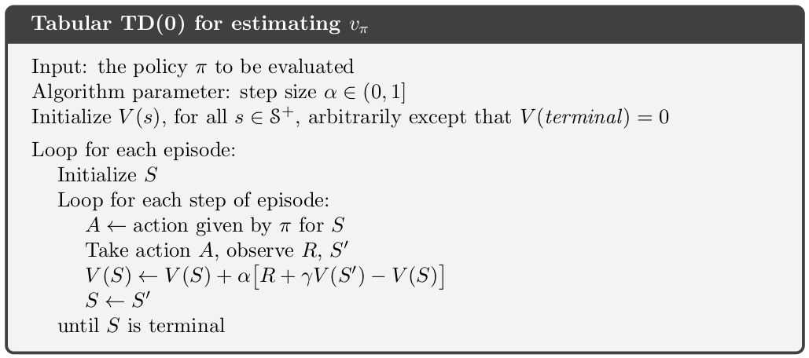

my notes on [course 1](/guillaume_blog/blog/reinforcement-learning-specialization-coursera.html)

**specialization roadmap** - course 2 - **Sample-based Learning Methods**

**course 2** - In Course 2, we built on these ideas and design algorithms for learning **without a model** of the world. We study three classes of methods designed for learning from trial and error interaction. We start with **Monte Carlo** methods and then move on to **temporal difference** learning, including Q learning. We conclude Course 2 with an investigation of methods for **planning** with learned models. 

Week 1 - Monte-Carlo Methods for Prediction & Control

Week 2 - Temporal Difference Learning Methods for Prediction

Week 3 - Temporal Difference Learning Methods for Control

Week 4 - Planning, Learning & Acting

## 5/25/21 - Course 2 - Week 1 - Monte-Carlo Methods for Prediction & Control

###### Module 1 Learning Objectives

**Lesson 1: Introduction to Monte-Carlo Methods** 

- Understand how Monte-Carlo methods can be used to estimate value functions from sampled interaction 
- Identify problems that can be solved using Monte-Carlo methods 
- Use Monte-Carlo prediction to estimate the value function for a given policy. 

**Lesson 2: Monte-Carlo for Control** 

- Estimate action-value functions using Monte-Carlo 
- Understand the importance of maintaining exploration in Monte-Carlo algorithms 
- Understand how to use Monte-Carlo methods to implement a GPI algorithm
- Apply Monte-Carlo with exploring starts to solve an MDP 

**Lesson 3: Exploration Methods for Monte-Carlo** 

- Understand why exploring starts can be problematic in real problems 
- Describe an alternative exploration method for Monte-Carlo control 

**Lesson 4: Off-policy learning for prediction** 

- Understand how off-policy learning can help deal with the exploration problem 
- Produce examples of target policies and examples of behavior policies
- Understand importance sampling 
- Use importance sampling to estimate the expected value of a target distribution using samples from a different distribution
- Understand how to use importance sampling to correct returns 
- Understand how to modify the Monte-Carlo prediction algorithm for off-policy learning.

###### Lesson 1: Introduction to Monte Carlo Methods

**Reading** Chapter 5.0-5.5 **(pp. 91-104)**  in the Reinforcement Learning textbook

> Although a model is required, the model need only generate sample transitions, not the complete probability distributions of all possible transitions that is required for dynamic programming (DP).

**Video What is Monte Carlo** by Martha

By the end of this video you will be able to *understand* how **Monte Carlo** methods can be used to estimate value functions from sampled interaction and *identify* problems that can be solved using Monte Carlo methods. 

**Video Using Monte Carlo for Prediction** by Martha

By the end of this video, you will be able to *use* **Monte Carlo prediction** to estimate the value function for a given policy. 

###### Lesson 2: Monte Carlo for Control

**Video Using Monte Carlo for Action Values** by Adam

By the end of this video, you'll be able to *estimate* **action-value functions** using Monte Carlo and *understand* the importance of **maintaining exploration** in Monte Carlo algorithms. 

**Video Using Monte Carlo methods for generalized policy iteration** by Adam

By the end of this video, you will *understand* how to use Monte Carlo methods to implement a **generalized policy iteration** GPI algorithm. 

**Video Solving the BlackJack Example** by Adam

By the end of this video, you'll be able to *apply* **Monte Carlo with Exploring Starts** to solve an example MDP. 

###### Lesson 3: Exploration Methods for Monte Carlo

**Video Epsilon-soft policies** by Adam

By the end of this video you will *understand* why exploring starts can be problematic in real problems and you will be able to *describe* an alternative expiration method to **maintain exploration** in Monte Carlo control. 

###### Lesson 4: Off-policy Learning for Prediction

**Video Why does off-policy learning matter?** by Martha

By the end of this video you will be able to *understand* how **off policy learning** can help deal with the expiration problem. You will also be able to *produce* examples of Target policies and examples of **behavior policies**. 

The key points to take away from today are that **off policy learning** is another way to obtain *continual exploration*. The policy that we are *learning* is called the **target policy** and the policy that we are choosing *actions* from is the **behavior policy**. 

**Video Importance Sampling** by Martha

By the end of this video, you will be able to *use* **importance sampling** to estimate the expected value of a target distribution using samples from a different distribution. 

**Video Off-Policy Monte Carlo Prediction** by Martha

By the end of this video, you will be able to *understand* how to use **important sampling** to correct returns, and you will *understand* how to modify the **Monte Carlo prediction algorithm** for off-policy learning. 

**Video Emma Brunskill: Batch Reinforcement Learning**

**Video Week 1 Summary** by Martha

**Reading** Chapter 5.10 **(pp. 115-116)**  in the Reinforcement Learning textbook

## 5/27/21 - Course 2 - Week 2 - Temporal Difference Learning Methods for Prediction

###### Module 2 Learning Objectives

**Lesson 1: Introduction to Temporal Difference Learning** 

- Define temporal-difference learning 
- Define the temporal-difference error 
- Understand the TD(0) algorithm

**Lesson 2: Advantages of TD** 

- Understand the benefits of learning online with TD 
- Identify key advantages of TD methods over Dynamic Programming and Monte Carlo methods 
- Identify the empirical benefits of TD learning

###### Lesson 1: Introduction to Temporal Difference Learning

**Reading** Chapter 6-6.3 **(pp. 116-128)**  in the Reinforcement Learning textbook

**Video What is Temporal Difference (TD) learning?** by Adam

By the end of this video, you'll be able to *define* **temporal difference learning**, *define* the **temporal difference error**, and *understand* the **TD(0) algorithm**. 

**Video Rich Sutton: The Importance of TD Learning** by Richard Sutton

###### Lesson 2: Advantages of TD 

**Video The advantages of temporal difference learning** by Martha

By the end of this video, you will be able to *understand* the benefits of **learning online with TD** and *identify* key advantages of TD methods over dynamic programming and Monte Carlo. 

**Video Comparing TD and Monte Carlo** by Adam

By the end of this video, you'll be able to *identify* the **empirical benefits** of **TD Learning**.

**Video Andy Barto and Rich Sutton: More on the History of RL**

**Video Week 2 Summary** by Adam

###### Assignment

Policy Evaluation in Cliff Walking Environment

notebooks in [github](https://github.com/castorfou/Reinforcement-Learning-specialization/tree/main/assignements/course%202%20week%202)

