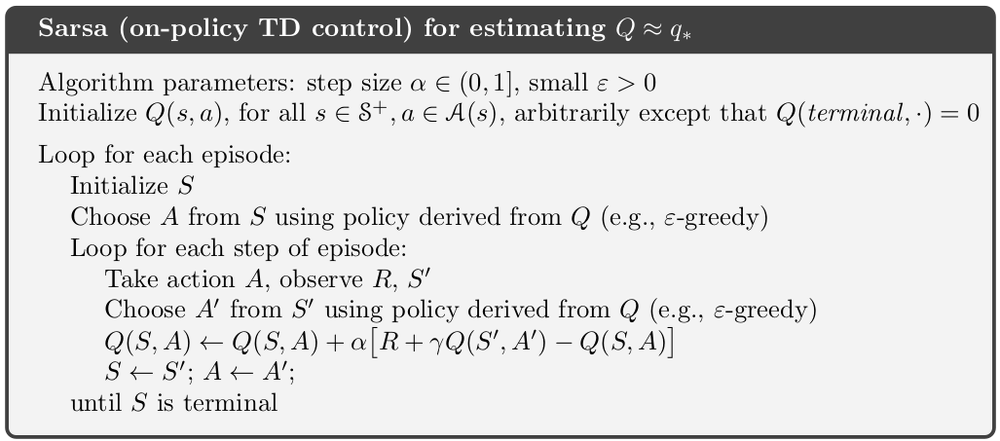

my notes on [course 1](/guillaume_blog/blog/reinforcement-learning-specialization-coursera.html)

**specialization roadmap** - course 2 - **Sample-based Learning Methods**

**course 2** - In Course 2, we built on these ideas and design algorithms for learning **without a model** of the world. We study three classes of methods designed for learning from trial and error interaction. We start with **Monte Carlo** methods and then move on to **temporal difference** learning, including Q learning. We conclude Course 2 with an investigation of methods for **planning** with learned models. 

Week 1 - Monte-Carlo Methods for Prediction & Control

Week 2 - Temporal Difference Learning Methods for Prediction

Week 3 - Temporal Difference Learning Methods for Control

Week 4 - Planning, Learning & Acting

## 5/25/21 - Course 2 - Week 1 - Monte-Carlo Methods for Prediction & Control

###### Module 1 Learning Objectives

**Lesson 1: Introduction to Monte-Carlo Methods** 

- Understand how Monte-Carlo methods can be used to estimate value functions from sampled interaction 
- Identify problems that can be solved using Monte-Carlo methods 
- Use Monte-Carlo prediction to estimate the value function for a given policy. 

**Lesson 2: Monte-Carlo for Control** 

- Estimate action-value functions using Monte-Carlo 
- Understand the importance of maintaining exploration in Monte-Carlo algorithms 
- Understand how to use Monte-Carlo methods to implement a GPI algorithm
- Apply Monte-Carlo with exploring starts to solve an MDP 

**Lesson 3: Exploration Methods for Monte-Carlo** 

- Understand why exploring starts can be problematic in real problems 
- Describe an alternative exploration method for Monte-Carlo control 

**Lesson 4: Off-policy learning for prediction** 

- Understand how off-policy learning can help deal with the exploration problem 
- Produce examples of target policies and examples of behavior policies
- Understand importance sampling 
- Use importance sampling to estimate the expected value of a target distribution using samples from a different distribution
- Understand how to use importance sampling to correct returns 
- Understand how to modify the Monte-Carlo prediction algorithm for off-policy learning.

###### Lesson 1: Introduction to Monte Carlo Methods

**Reading** Chapter 5.0-5.5 **(pp. 91-104)**  in the Reinforcement Learning textbook

> Although a model is required, the model need only generate sample transitions, not the complete probability distributions of all possible transitions that is required for dynamic programming (DP).

**Video What is Monte Carlo** by Martha

By the end of this video you will be able to *understand* how **Monte Carlo** methods can be used to estimate value functions from sampled interaction and *identify* problems that can be solved using Monte Carlo methods. 

**Video Using Monte Carlo for Prediction** by Martha

By the end of this video, you will be able to *use* **Monte Carlo prediction** to estimate the value function for a given policy. 

###### Lesson 2: Monte Carlo for Control

**Video Using Monte Carlo for Action Values** by Adam

By the end of this video, you'll be able to *estimate* **action-value functions** using Monte Carlo and *understand* the importance of **maintaining exploration** in Monte Carlo algorithms. 

**Video Using Monte Carlo methods for generalized policy iteration** by Adam

By the end of this video, you will *understand* how to use Monte Carlo methods to implement a **generalized policy iteration** GPI algorithm. 

**Video Solving the BlackJack Example** by Adam

By the end of this video, you'll be able to *apply* **Monte Carlo with Exploring Starts** to solve an example MDP. 

###### Lesson 3: Exploration Methods for Monte Carlo

**Video Epsilon-soft policies** by Adam

By the end of this video you will *understand* why exploring starts can be problematic in real problems and you will be able to *describe* an alternative expiration method to **maintain exploration** in Monte Carlo control. 

###### Lesson 4: Off-policy Learning for Prediction

**Video Why does off-policy learning matter?** by Martha

By the end of this video you will be able to *understand* how **off policy learning** can help deal with the expiration problem. You will also be able to *produce* examples of Target policies and examples of **behavior policies**. 

The key points to take away from today are that **off policy learning** is another way to obtain *continual exploration*. The policy that we are *learning* is called the **target policy** and the policy that we are choosing *actions* from is the **behavior policy**. 

**Video Importance Sampling** by Martha

By the end of this video, you will be able to *use* **importance sampling** to estimate the expected value of a target distribution using samples from a different distribution. 

**Video Off-Policy Monte Carlo Prediction** by Martha

By the end of this video, you will be able to *understand* how to use **important sampling** to correct returns, and you will *understand* how to modify the **Monte Carlo prediction algorithm** for off-policy learning. 

**Video Emma Brunskill: Batch Reinforcement Learning**

**Video Week 1 Summary** by Martha

**Reading** Chapter 5.10 **(pp. 115-116)**  in the Reinforcement Learning textbook

## 5/27/21 - Course 2 - Week 2 - Temporal Difference Learning Methods for Prediction

###### Module 2 Learning Objectives

**Lesson 1: Introduction to Temporal Difference Learning** 

- Define temporal-difference learning 
- Define the temporal-difference error 
- Understand the TD(0) algorithm

**Lesson 2: Advantages of TD** 

- Understand the benefits of learning online with TD 
- Identify key advantages of TD methods over Dynamic Programming and Monte Carlo methods 
- Identify the empirical benefits of TD learning

###### Lesson 1: Introduction to Temporal Difference Learning

**Reading** Chapter 6-6.3 **(pp. 116-128)**  in the Reinforcement Learning textbook

**Video What is Temporal Difference (TD) learning?** by Adam

By the end of this video, you'll be able to *define* **temporal difference learning**, *define* the **temporal difference error**, and *understand* the **TD(0) algorithm**. 

**Video Rich Sutton: The Importance of TD Learning** by Richard Sutton

###### Lesson 2: Advantages of TD 

**Video The advantages of temporal difference learning** by Martha

By the end of this video, you will be able to *understand* the benefits of **learning online with TD** and *identify* key advantages of TD methods over dynamic programming and Monte Carlo. 

**Video Comparing TD and Monte Carlo** by Adam

By the end of this video, you'll be able to *identify* the **empirical benefits** of **TD Learning**.

**Video Andy Barto and Rich Sutton: More on the History of RL**

**Video Week 2 Summary** by Adam

###### Assignment

Policy Evaluation in Cliff Walking Environment

notebooks in [github](https://github.com/castorfou/Reinforcement-Learning-specialization/tree/main/assignements/course%202%20week%202)

## 6/1/21 - Course 2 - Week 3 - Temporal Difference Learning Methods for Control

###### Module 3 Learning Objectives

**Lesson 1: TD for Control** 

- Explain how generalized policy iteration can be used with TD to find improved policies 
- Describe the Sarsa control algorithm 
- Understand how the Sarsa control algorithm operates in an example MDP 
- Analyze the performance of a learning algorithm 

**Lesson 2: Off-policy TD Control: Q-learning** 

- Describe the Q-learning algorithm 
- Explain the relationship between Q-learning and the Bellman optimality equations. 
- Apply Q-learning to an MDP to find the optimal policy 
- Understand how Q-learning performs in an example MDP 
- Understand the differences between Q-learning and Sarsa 
- Understand how Q-learning can be off-policy without using importance sampling 
- Describe how the on-policy nature of Sarsa and the off-policy nature of Q-learning affect their relative performance 

**Lesson 3: Expected Sarsa** 

- Describe the Expected Sarsa algorithm 
- Describe Expected Sarsa’s behaviour in an example MDP 
- Understand how Expected Sarsa compares to Sarsa control 
- Understand how Expected Sarsa can do off-policy learning without using importance sampling 
- Explain how Expected Sarsa generalizes Q-learning

###### **Lesson 1: TD for Control** 

**Reading** Chapter 6.4-6.6 **(pp. 129-134)**  in the Reinforcement Learning textbook

**Video** **Sarsa: GPI with TD** by Martha

By the end of this video, you'll be able to *explain* how generalized policy iteration can be used with TD to find **improved policies**, as well as *describe* the **Sarsa control algorithm**

**Video Sarsa in the Windy Grid World** by Adam

By the end of this video, you will *understand* how the **Sarsa** control algorithm operates in an example **MDP**. You will also *gain experience* analyzing the **performance** of a learning algorithm. 

###### **Lesson 2: Off-policy TD Control: Q-learning** 

**Video What is Q-learning?** by Martha

By the end of this video, you will be able to *describe* the **Q-learning** algorithm, and *explain* the relationship between **Q-learning** and the **Bellman optimality equations**. 

**Video Q-learning in the Windy Grid World** by Adam

By the end of this video, you will *gain insight* into how **Q-Learning** performs in an example **MDP**. And *gain experience* comparing the **performance** of multiple learning algorithms on a single MDP.

**Video How is Q-learning off-policy?** by Martha

By the end of this video, you will *understand* how Q-learning can be **off-policy** without using **important sampling** and be able to *describe* how learning **on-policy or off-policy** might affect performance in **control**. 

###### **Lesson 3: Expected Sarsa** 

**Video Expected Sarsa** by Martha

By the end of this video, you will be able to *explain* the **expected Sarsa** algorithm.

**Video Expected Sarsa in the Cliff World** by Adam

By the end of this video, you will be able to *describe* **expected Sarsas**'s behavior in an example **MDP** and *empirically* compare **expected Sarsa** and **Sarsa**. 

**Video Generality of Expected Sarsa** by Martha

By the end of this video, you will *understand* how Expected Sarsa can do **off-policy** learning without using **importance sampling** and *explain* how **Expected Sarsa** generalizes **Q-learning**. 

**Video Week 3 summary** by Adam

Sarsa uses a sample based version of the Bellman equation. It learns Q-pi. 

Q-learning uses the Bellman optimality equation. It learns Q-star. 

Expected sarsa uses the same Bellman equation as Sarsa, but samples it differently. It takes an expectation over the next action values. 

What's the story with on-policy and off-policy learning? 

Sarsa is a on-policy algorithm that learns the action values for the policy it's currently following. Q-learning is an off-policy algorithm that learns the optimal action values. And Expected Sarsa is both an on-policy and an off-policy algorithm that can learn the action values for any policy. 

###### Assignment

Q-Learning and Expected Sarsa

notebooks in [github](https://github.com/castorfou/Reinforcement-Learning-specialization/tree/main/assignements/course%202%20week%203)

## 6/3/21 - Course 2 - Week 4 - Planning, Learning & Acting

###### Module 4 Learning Objectives

**Lesson 1: What is a model?** 

- Describe what a model is and how they can be used 
- Classify models as distribution models or sample models 
- Identify when to use a distribution model or sample model 
- Describe the advantages and disadvantages of sample models and distribution models 
- Explain why sample models can be represented more compactly than distribution models

**Lesson 2: Planning** 

- Explain how planning is used to improve policies 
- Describe random-sample one-step tabular Q-planning 

**Lesson 3: Dyna as a formalism for planning** 

- Recognize that direct RL updates use experience from the environment to improve a policy or value function 
- Recognize that planning updates use experience from a model to improve a policy or value function 
- Describe how both direct RL and planning updates can be combined through the Dyna architecture 
- Describe the Tabular Dyna-Q algorithm 
- Identify the direct-RL and planning updates in Tabular Dyna-Q 
- Identify the model learning and search control components of Tabular Dyna-Q 
- Describe how learning from both direct and simulated experience impacts performance 
- Describe how simulated experience can be useful when the model is accurate 

**Lesson 4: Dealing with inaccurate models** 

- Identify ways in which models can be inaccurate 
- Explain the effects of planning with an inaccurate model 
- Describe how Dyna can plan successfully with a partially inaccurate model 
- Explain how model inaccuracies produce another exploration-exploitation trade-off 
- Describe how Dyna-Q+ proposes a way to address this trade-off

**Lesson 5: Course wrap-up**

###### **Lesson 1: What is a model?** 

**Reading** Chapter 8.1-8.3 **(pp. 159-166)**  in the Reinforcement Learning textbook

> Model-based methods rely on planning as their primary component, while model-free methods primarily rely on learning.

**Video What is a Model?** by Martha

By the end of the video, you will be able to *describe* a **model** and how it can be used, *classify* models as **distribution models** or **sample models**, and *identify* when to use a **distribution model** or **sample model**. 

**Video Comparing Sample and Distribution Models** by Martha

By the end of this video, you will be able to *describe* the **advantages and disadvantages** of **sample models** and **distribution models**, and you will also be able to *explain* why **sample models** can be represented **more compactly** than **distribution models**. 

###### **Lesson 2: Planning** 

**Video Random Tabular Q-planning** by Martha

By the end of this video, you'll be able to *explain* how **planning** is used to **improve policies** and *describe* **random-sample one-step tabular Q-planning**. 

