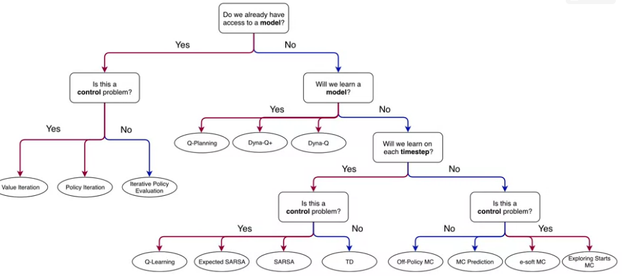

Coursera website:  [course 3 - Prediction and Control with Function Approximation](https://www.coursera.org/learn/prediction-control-function-approximation/home/welcome) of [Reinforcement Learning Specialization](https://www.coursera.org/specializations/reinforcement-learning)

my notes on [course 1 - Fundamentals of Reinforcement Learning](/guillaume_blog/blog/reinforcement-learning-specialization-coursera.html), [course 2 - Sample-based Learning Methods](/guillaume_blog/blog/reinforcement-learning-specialization-coursera-course2.html)

**specialization roadmap** - course 3 - **Prediction and Control with Function Approximation** [(syllabus)](https://github.com/castorfou/Reinforcement-Learning-specialization/blob/main/course%203%20-%20function%20approximation/Course-3_Prediction-and-Control-with-Function-Approximation-Learning-Objectives.pdf)

**course 3** - In Course 3, we leave the relative comfort of small finite MDPs and investigate RL with **function approximation**. Here we will see that the main concepts from Courses 1 and 2 transferred to problems with larger **infinite state spaces**. We will cover **feature construction**, **neural network learning**, **policy gradient methods**, and other particularities of the function approximation setting.

Week 1 - On-policy Prediction with Approximation

Week 2 - Constructing Features for Prediction

Week 3 - Control with Approximation

Week 4 - Policy Gradient

###### Course introduction

**Video by Adam and Martha**

In course 2:

In course 3:

## Course 3 - Week 1 - On-policy Prediction with Approximation

###### Module 1 Learning Objectives

**Lesson 1: Estimating Value Functions as Supervised Learning** 

- Understand how we can use parameterized functions to approximate value functions 
- Explain the meaning of linear value function approximation 
- Recognize that the tabular case is a special case of linear value function approximation. 
- Understand that there are many ways to parameterize an approximate value function 
- Understand what is meant by generalization and discrimination 
- Understand how generalization can be beneficial 
- Explain why we want both generalization and discrimination from our function approximation 
- Understand how value estimation can be framed as a supervised learning problem 
- Recognize not all function approximation methods are well suited for reinforcement learning 

**Lesson 2: The Objective for On-policy Prediction** 

- Understand the mean-squared value error objective for policy evaluation 
- Explain the role of the state distribution in the objective 
- Understand the idea behind gradient descent and stochastic gradient descent 
- Outline the gradient Monte Carlo algorithm for value estimation 
- Understand how state aggregation can be used to approximate the value function 
- Apply Gradient Monte-Carlo with state aggregation 

**Lesson 3: The Objective for TD** 

- Understand the TD-update for function approximation 
- Highlight the advantages of TD compared to Monte-Carlo 
- Outline the Semi-gradient TD(0) algorithm for value estimation 
- Understand that TD converges to a biased value estimate 
- Understand that TD converges much faster than Gradient Monte Carlo 

**Lesson 4: Linear TD** 

- Derive the TD-update with linear function approximation 
- Understand that tabular TD(0) is a special case of linear semi-gradient TD(0) 
- Highlight the advantages of linear value function approximation over nonlinear 
- Understand the fixed point of linear TD learning 
- Describe a theoretical guarantee on the mean squared value error at the TD fixed point

###### Lesson 1: Estimating Value Functions as Supervised Learning 

**Reading** Chapter 9.1-9.4 **(pp. 197-209)**  in the Reinforcement Learning textbook

> In many of the tasks to which we would like to apply reinforcement learning the state space is combinatorial and enormous; the number of possible camera images, for example, is much larger than the number of atoms in the universe.
>
> In many of our target tasks, almost every state encountered will never have been seen before. To make sensible decisions in such states it is necessary to generalize from previous encounters with different states that are in some sense similar to the current one. In other words, the key issue is that of **generalization**. How can experience with a limited subset of the state space be usefully generalized to produce a good approximation over a much larger subset?
>
> Fortunately, generalization from examples has already been extensively studied, and
> we do not need to invent totally new methods for use in reinforcement learning. To some extent we need only combine reinforcement learning methods with existing generalization methods. The kind of generalization we require is often called function approximation because it takes examples from a desired function (e.g., a value function) and attempts to generalize from them to construct an approximation of the entire function. Function approximation is an instance of supervised learning, the primary topic studied in machine learning, artificial neural networks, pattern recognition, and statistical curve fitting.

**Video Moving to Parameterized Functions** by Adam

By the end of this video, you'll be able to *understand* how we can use **parameterized functions** to approximate values, *explain* **linear value function approximation**, *recognize* that the tabular case is a special case of linear value function approximation, and *understand* that there are many ways to parameterize an approximate value function. 

**Video Generalization and Discrimination** by Martha

By the end of this video, you will be able to *understand* what is meant by **generalization** and **discrimination**, *understand* how generalization can be beneficial, and *explain* why we want both generalization and discrimination from our function approximation. 

**Video Framing Value Estimation as Supervised Learning** by Martha

By the end of this video, you will be able to *understand* how value estimation can be framed as a **supervised learning** problem, and *recognize* that not all function approximation methods are well suited for reinforcement learning. 

###### **Lesson 2: The Objective for On-policy Prediction** 

**Video The Value Error Objective** by Adam

By the end of this video you will be able to *understand* the **Mean Squared Value Error objective** for policy evaluation and *explain* the role of the **state distribution** in the objective. 

$$
\overline{VE}=\displaystyle\sum_{s}\mu(s)[v_\pi(s)-\hat{v}(s,w)]^2
$$
This is the **Mean Squared Value Error Objective** where $\mu$ reflects how much we care about each state (a probability distribution)

**Video Introducing Gradient Descent** by Martha

By the end of this video, you will be able to *understand* the idea of **gradient descent**, and *understand* that gradient descent converges to stationary points. 

**Video Gradient Monte for Policy Evaluation** by Martha

By the end of this video, you will be able to *understand* how to use gradient descent and **stochastic gradient descent** to minimize value error and *outline* the **Gradient Monte Carlo** algorithm for value estimation. 

**Video State Aggregation with Monte Carlo** by Adam

By the end of this video, you will be able to *understand* how **state aggregation** can be used to approximate the value function and *apply* gradient Monte Carlo with state aggregation. 

###### **Lesson 3: The Objective for TD** 

**Video Semi-Gradient TD for Policy Evaluation** by Adam

By the end of this video you will be able to *understand* the **TD update** for function approximation, and *outline* the **semi-gradient TD(0)** algorithm for value estimation. 

**Video Comparing TD and Monte Carlo with State Aggregation** by Adam

By the end of this video, you'll be able to *understand* that TD converges to a bias value estimate and *understand* that TD can learn faster than Gradient Monte Carlo. 

**Video Doina Precup: Building Knowledge for AI Agents with Reinforcement Learning**

###### **Lesson 4: Linear TD** 

**Video The Linear TD Update** by Martha

By the end of this video, you'll be able to *derive* the TD update with linear function approximation, *understand* that tabular TD(0) as a special case of **linear semi gradient TD(0)**, and *understand* why we care about linear TD as a special case. 

**Video The True Objective for TD** by Martha

By the end of this video, you will be able to *understand* the **fixed point** of linear TD and *describe* a theoretical guarantee on the mean squared value error at the TD fixed point. 

**Video Week 1 Summary** by Adam

###### Assignment

TD with State Aggregation

notebooks in [github](https://github.com/castorfou/Reinforcement-Learning-specialization/tree/main/assignements/course%203%20week%201)

